# Spybee — Mapa de incidencias & Dashboard

Prueba técnica de Frontend (Next.js / React) para Spybee. La aplicación recrea el flujo de **creación de incidencias sobre un mapa** de una obra de construcción y un **dashboard** que resume el estado de esas incidencias.

## Lo más destacado

- **Reflejo inmediato**: al crear una incidencia desde el formulario, aparece al instante en el mapa y en el dashboard, sin recargar la página.
- **Mapa interactivo**: cada incidencia se ve como un marcador con color según su prioridad/estado, y con un click se puede consultar su detalle completo.
- **Formulario completo y guiado**: título, descripción, categoría, prioridad, ubicación (eligiendo el punto directamente sobre el mapa), fecha límite, responsables, etiquetas y archivos adjuntos. Los campos de categoría y prioridad cambian sutilmente de color según lo seleccionado, para identificar el tipo de incidencia de un vistazo.
- **Dashboard pensado para tomar decisiones rápido**: indicadores clave, alertas de incidencias vencidas o próximas a vencer, tabla de "atención requerida", tendencias en el tiempo, distribución por categoría/etiqueta, desempeño del equipo y un calendario/mapa de calor de actividad.
- **Todo es interactivo**: se puede filtrar la tabla haciendo click en los gráficos, cambiar el periodo de tiempo y ver cómo se recalculan los indicadores al momento.
- **Diseño responsive**: la aplicación se ve y funciona bien tanto en computador como en celular o tablet.
- **Flujo de inicio de sesión completo**: incluye pantallas de registro y recuperación de contraseña (de demostración), además del login.

## Acceso

La app cuenta con un flujo de autenticación (UI completa de login, registro y recuperación de contraseña), pero por ser una demo solo existe **un usuario válido**. Cualquier otra combinación de correo/contraseña muestra un mensaje de error y no permite el acceso. Las credenciales de prueba se comparten por aparte.

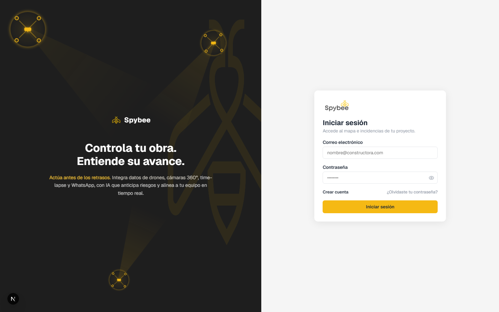

## Stack

- **Next.js 16** y **React 19**: el framework y la librería sobre los que está construida toda la aplicación.
- **Zustand**: guarda la información que la app necesita recordar mientras se usa (la sesión del usuario y la lista de incidencias).
- **react-map-gl / Mapbox GL**: muestra el mapa interactivo y los marcadores de incidencias.
- **Recharts**: dibuja los gráficos del dashboard (donuts, tendencias, calendario, etc.).
- **SCSS Modules**: el sistema de estilos, con colores, espaciados y tamaños compartidos en `src/styles/` para mantener todo visualmente consistente.
- **lucide-react**: los iconos usados en toda la interfaz.

## Mapa de incidencias

Vista principal de la app (`/`). Muestra todas las incidencias del proyecto como marcadores sobre el mapa, coloreados según su prioridad/estado. Al hacer click en un marcador se abre un popup con el resumen de la incidencia.

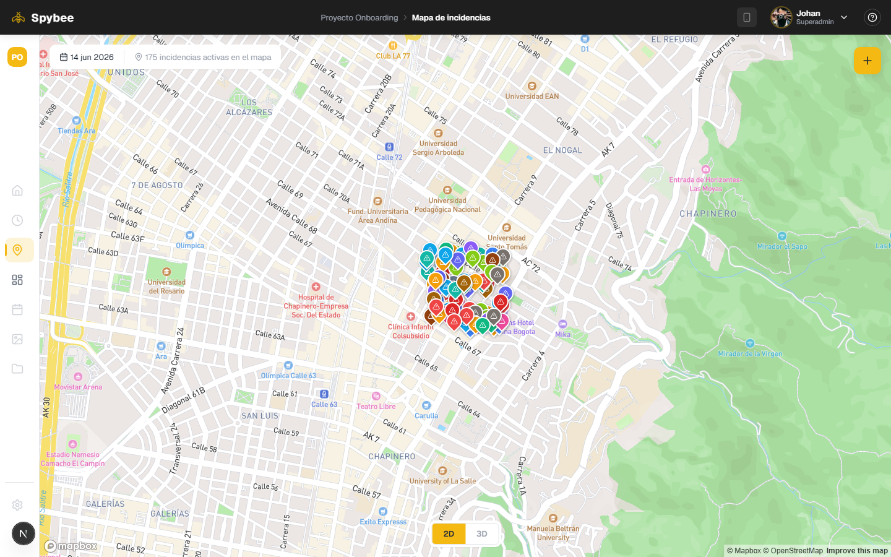

Al hacer click en un marcador se abre un popup con el número de incidencia, título, descripción, etiquetas de estado/prioridad y ubicación dentro de la obra.

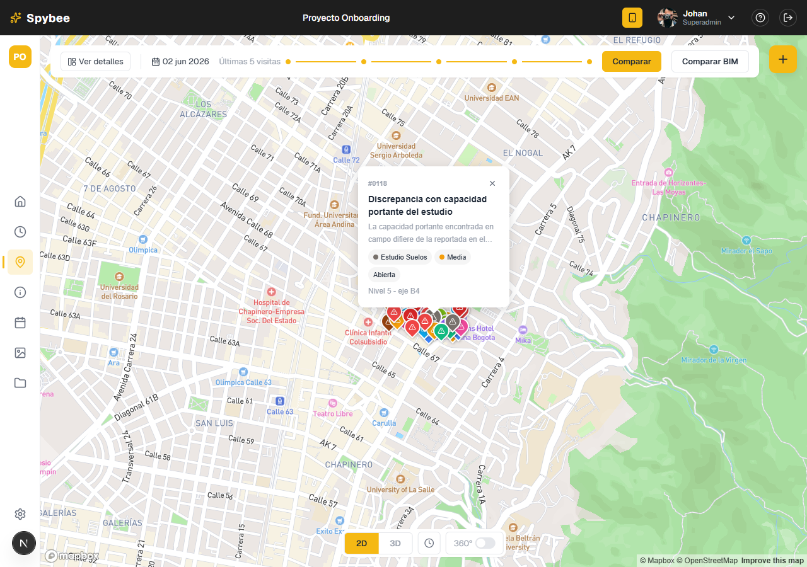

### Crear incidencia

Desde la barra superior del mapa se abre un modal con el formulario de creación: título, descripción, categoría, prioridad, ubicación (con selector de punto sobre el mapa), fecha límite, asignados/observadores, etiquetas y adjuntos. Los campos de **Categoría** y **Prioridad** resaltan con un color sutil acorde a la opción seleccionada, para identificar de un vistazo a qué tipo de incidencia corresponde.

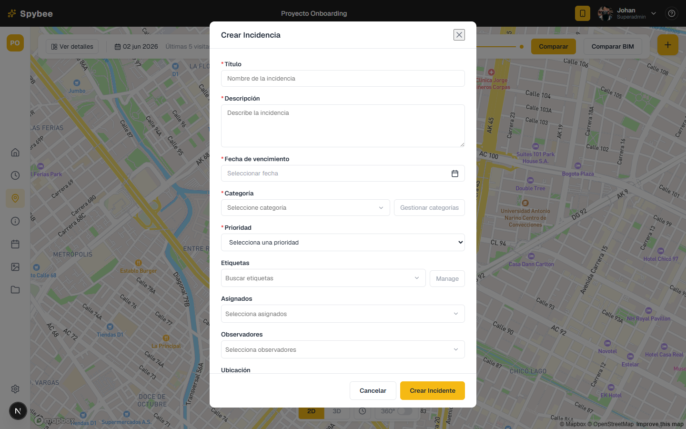

Al enviarlo, la incidencia se guarda en la aplicación y aparece de inmediato en el mapa y en el dashboard, sin necesidad de recargar la página.

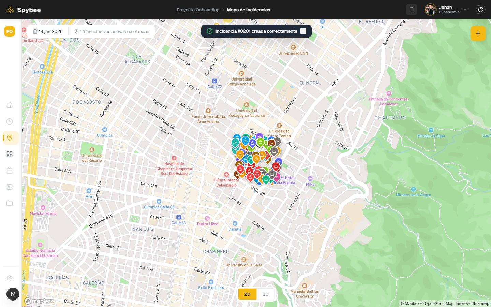

## Dashboard

Vista `/dashboard`. La barra superior queda reducida a lo esencial (ruta del proyecto, título, selector de periodo y botón "Crear incidencia"), dejando todo el espacio para el contenido. Las secciones están ordenadas de lo más accionable a lo más general:

1. **KPIs e indicadores de riesgo**: incidencias abiertas, creadas/cerradas en el periodo, tasa de cierre, tiempo promedio de resolución y vencidas activas, junto con alertas de vencidas hoy, sin actualizar, alta prioridad abierta y próximas a vencer.
2. **Atención requerida**: tabla de incidencias críticas (vencidas o por vencer); cada fila abre el detalle de la incidencia en un modal.
3. **Tendencia**: incidencias creadas/cerradas por día, semana o mes, con una línea de pendientes acumuladas.
4. **Panorama general**: distribución por estado y por prioridad (donuts).
5. **Distribución detallada**: incidencias por categoría y por etiqueta.
6. **Desempeño del equipo**: quién resuelve más, quién reporta más y la carga de trabajo actual.
7. **Calendario de actividad y mapa de calor** de incidencias.

Todo es interactivo: los donuts y chips de indicadores filtran la tabla, el selector de periodo recalcula KPIs y tendencias, etc.

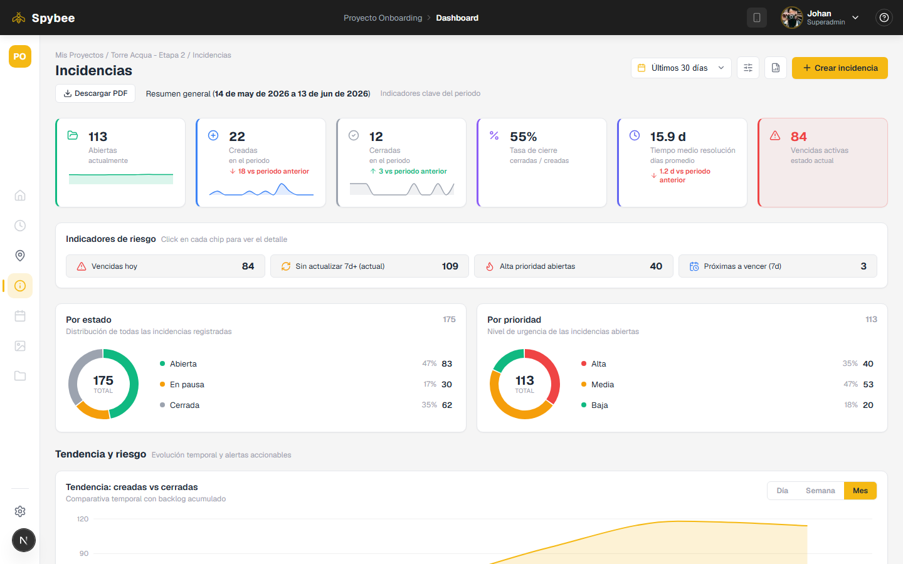

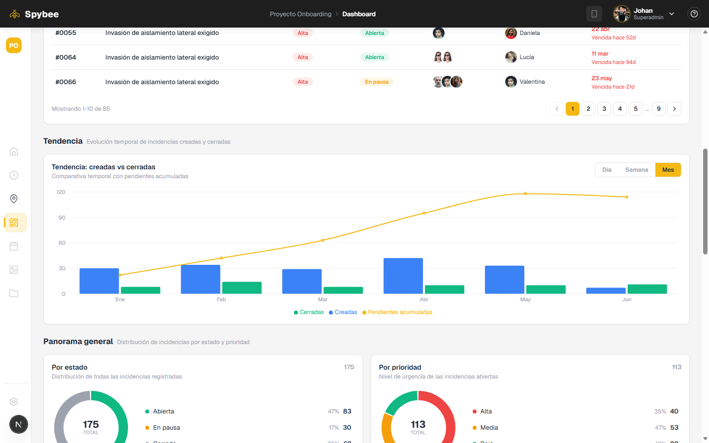

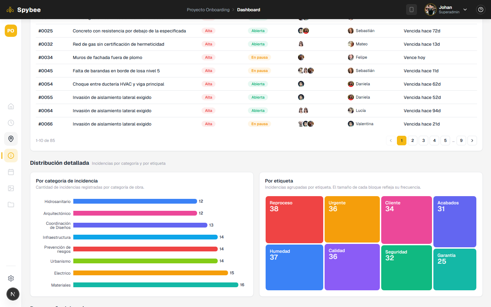

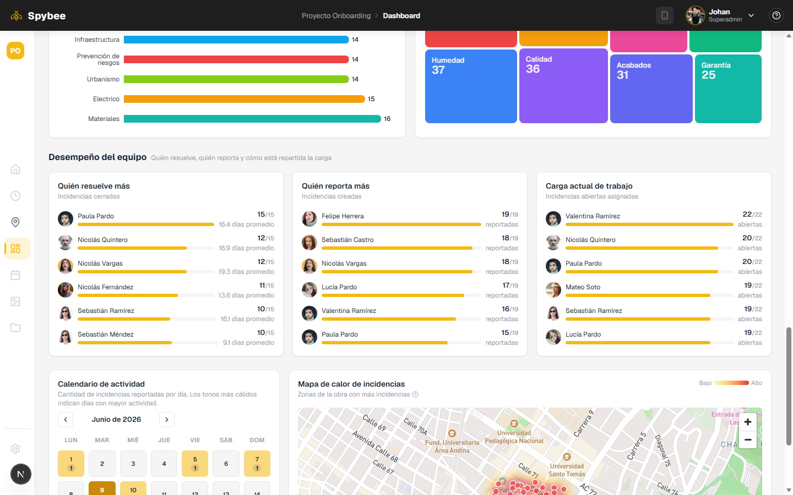

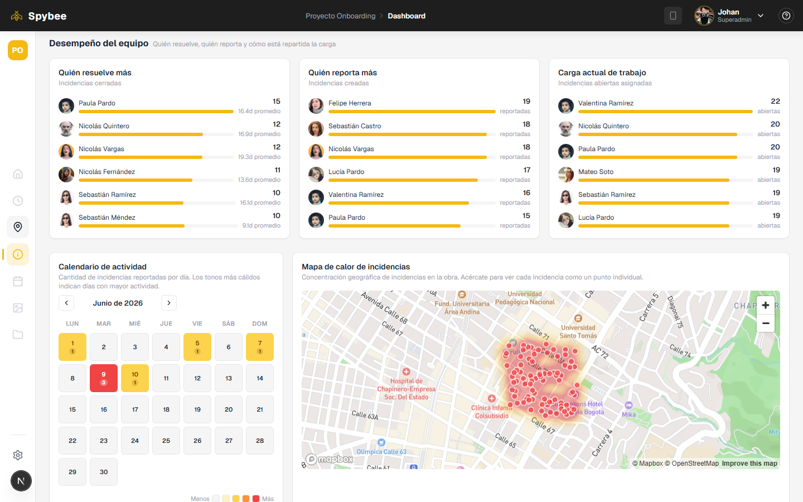

### Responsive

La app es usable en mobile y tablet (sidebar colapsable, KPIs y gráficos apilados).

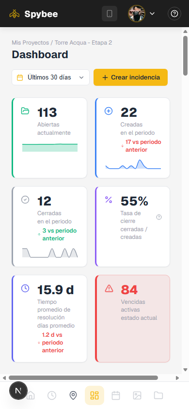

## Estructura del proyecto

> Esta sección es para quienes vayan a revisar el código: muestra cómo está organizado el proyecto, carpeta por carpeta.

```
src/
  app/
    (app)/              # Rutas protegidas (mapa + dashboard), compartidas por AppShell
    login/              # Inicio de sesión
    register/           # Registro (demo, no crea usuarios reales)
    forgot-password/    # Recuperar contraseña (demo)
  components/
    auth/               # AuthLayout, AuthCard, AuthGuard, DroneSwarm (compartidos por las 3 vistas de auth)
    layout/             # AppShell, Header, Sidebar
    map/                # MapView, marcadores, popup, controles, top bar
    incidents/          # Modal de creación de incidencia y sus campos de formulario
    dashboard/          # KPIs, donuts, treemap, tablas, calendario, heatmap, etc.
  lib/                  # Lógica de datos: métricas del dashboard, opciones, colores, fechas
  store/                # Zustand: authStore (sesión) e incidentsStore (incidencias)
  styles/               # Variables y animaciones SCSS compartidas
  types/                # Tipos de dominio (Incident, IncidentUser, etc.)
data/
  incidents.mock.json   # Dataset de incidencias provisto para la prueba
```

## Decisiones técnicas y por qué

**Datos y estado (Zustand, sin backend).** Toda la app trabaja sobre `data/incidents.mock.json`, cargado una sola vez en `useIncidentsStore`. Crear una incidencia nueva simplemente la antepone al array en memoria — es lo más simple que cumple el requisito de "se ve reflejada al instante" sin montar un backend real. La sesión vive en `useAuthStore` con `persist`, para que el login sobreviva a un refresh.

**Mapa desacoplado de los datos.** `MapView` es un componente de presentación puro (recibe `markers`/`popup`/`children` como `ReactNode`); quien decide qué incidencias mostrar y cómo es la página que lo usa. Esto permite reusar el mapa tanto en la vista principal como en el selector de ubicación del formulario de creación, sin duplicar la configuración de Mapbox.

**Métricas del dashboard centralizadas en `lib/dashboardMetrics.ts`.** Todos los cálculos (conteos por estado/prioridad, tendencia, incidencias críticas, rankings de equipo, comparación entre periodos, etc.) son funciones puras que reciben el array de incidencias. Así los componentes del dashboard solo renderizan, y la lógica de negocio queda en un solo lugar.

**"Críticas para hoy" con criterio acotado.** En vez de marcar como crítica cualquier incidencia de prioridad alta, la tabla muestra solo las que están **vencidas o vencen en los próximos 3 días** — es el criterio que realmente requiere atención inmediata y evita saturar la tabla con todo el backlog de alta prioridad.

**SCSS Modules + variables compartidas.** Cada componente tiene su propio `.module.scss` (sin colisión de clases), pero todos importan `src/styles/_variables.scss` (`@use "..." as *`) para colores, espaciados, radios y breakpoints — así la paleta y el sistema de diseño son consistentes sin un framework de UI completo.

**Autenticación de un solo usuario.** El brief no pedía un backend de auth real, así que se optó por una validación simple en el cliente contra un usuario fijo (`CURRENT_USER` + `DEMO_PASSWORD` en `lib/incidentOptions.ts`). Registro y "olvidé mi contraseña" tienen UI completa y funcional en cuanto a flujo/validaciones, pero son demostrativos (no crean cuentas reales).

**Imágenes con `next/image`.** Avatares (incluyendo los remotos de `i.pravatar.cc`, configurados en `next.config.ts`) y logos usan `next/image` para optimización automática; la única excepción es la previsualización de archivos subidos en el formulario de creación, que usa `blob:` URLs locales (no soportadas por el optimizador de imágenes).

## Correr el proyecto

```bash
npm install
cp .env.local.example .env.local   # agregar tu NEXT_PUBLIC_MAPBOX_TOKEN
npm run dev
```

Abrir [http://localhost:3000](http://localhost:3000).
